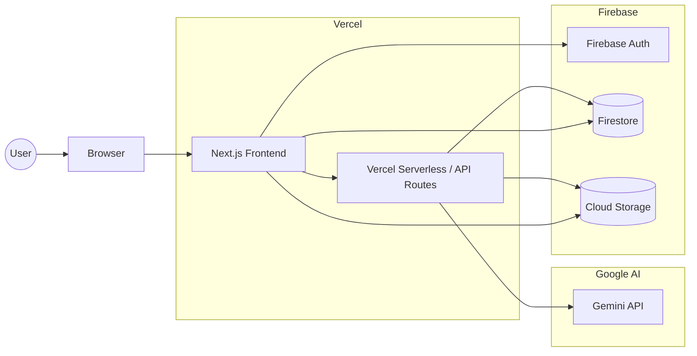

# Claude Code で構成図を全自動化しようとして失敗した話【Mermaid に落ち着いた】

Miro でシステム構成図を運用していると、
気づいたら図が増えていて、「どれが最新版だっけ？」となりがちです。

ちょっとした修正のつもりが、
箱を動かして、線を引き直して……と、地味に時間を取られます。

最初は、Claude Code を使って **SVG まで全部自動生成できたら楽だよな** と思って
実際に試してみたんですが、これがなかなか運用が大変で、正直続きませんでした。

諦めて **Mermaid + Claude Code + diagrams.net** に寄せた運用にしてみたところ、
構成図を作る・直すのがだいぶ楽になりました。

この記事は、そのときに試行錯誤した内容をまとめたものです。

## TL;DR（先に結論）

- 構成図は Mermaid で「形」を決める
- Claude Code には **Mermaid まで**やってもらう
- あとは diagrams.net に貼って、アイコンと配置をちょっと直すだけ
- SVG まで全部自動にしようとすると、だいたいしんどくなる
- 今はこのやり方で落ち着いてる

<!-- TOC -->

---

## なぜ「全部任せる」は無理だったのか

Claude Code に SVG まで出力させる運用も、最初は真面目に試しました。

ただ、やってみると次のような問題が出てきました。

- 少し手で直した SVG が、再生成ですべて上書きされる
- SVG の差分が読めず、レビューしづらい
- 「直したいのはそこじゃない」というズレが頻発する
- 公式アイコンや細かい配置調整が毎回崩れる

Claude Code 自体が悪いわけではなく、
自動化する粒度を間違えると、運用が壊れるという感覚でした。

「これは楽になるやつだ」と思って始めたのに、
いつの間にか生成物に振り回される側になってしまい、
このやり方は長く続かないな、という結論に至りました。

---

## 背景：構成図を「手で描く」のがしんどい

システム構成図は次のようなタイミングで何度も更新が入ります。

- API の追加・削除
- 認証フローの変更
- AI／外部サービスの追加
- セキュリティ境界の整理

そのたびに diagrams.net を開いて箱を移動し線を引き直す、という地味な手作業が発生します。

---

## 方針：構成図を「コード寄り」に扱う

そこで、構成図を以下のように分業しました。

- **人間**：意図・要件を書く
- **Claude Code**：構造を Mermaid に落とす
- **人間**：見た目を整えて確定する

「全部自動化」ではなく、
**壊れやすい部分を人間に残す**のがポイントです。

---

## 全体の流れ

```
PDD（Product Design Document）
   ↓
Claude Code
   ↓
Mermaid（diagram.mmd）
   ↓
diagrams.net（貼り付け）
   ↓
SVG（成果物）
```


*Claude Code で生成した Mermaid を diagrams.net に貼り付けた例*

---

## PDD（プロダクトデザインドキュメント）に書くこと

PDD は構成図作成のための材料をまとめたドキュメントとして用います。

```markdown
# システム概要（PDD 抜粋）
- Webアプリ
- 一般ユーザー向け
```

---

## Claude Code にやらせること

Claude Code の役割は **Mermaid を生成するところまで**。

- flowchart LR 固定
- subgraph で境界を表現
- 説明文は出させない

### Mermaid の実コード（今回の元ネタ）



---

## diagrams.net での作業は最小限

- Mermaid を貼り付けて図を生成する
- 公式アイコンに差し替える
- 線の交差やレイアウトを微調整する

---

## まとめ

- 構成図は「全部自動化」しなくていい
- Claude Code は構造を固めるところまでがちょうどいい
- Mermaid × diagrams.net に分けると、運用が安定する

「どこまで任せるか」を決めるのも、設計の一部なんだなと感じました。
