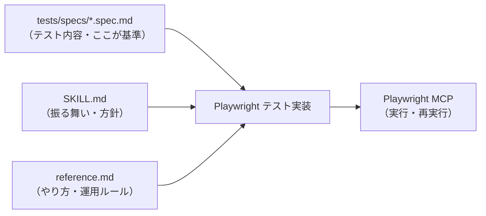

# Playwright MCP × Skillsで、ローカルテストが一気に速くなった

この記事では、**ローカルでUI確認を回すことが多いフロントエンド担当向け**に、
毎回の長いプロンプト運用をやめて、Skills + Markdown に寄せて修正サイクルを短縮できた話をまとめます。

## TL;DR（先に結論）
- 共通の指示を Skills に逃がして、プロンプトを短くする
- その回のテスト内容だけを Markdown に書く
- ローカルテストを「短い指示で即実行」に寄せる

## 前提
- Playwright MCP を使える環境
- GitHub Copilot Skills を使う運用
- テスト内容を Markdown にまとめる方針

<!-- TOC -->

---

## はじめに

Playwright MCP でローカルテストを回していると、UI の仕様変更が頻繁に入って、同じテストを何度も回すことになります。そのたびに、テスト内容をプロンプトへ貼り付け直すのが地味にしんどかったです。

そこで、
- 共通の指示は Skills にまとめる
- その回のテスト内容は Markdown に書く

という運用にしました。
結果、プロンプトがかなり短くなって、修正→確認のサイクルが体感で半分くらいに短縮されました。

---

## 全体構成（シンプル版）

### ディレクトリ構成

今回の構成は、できるだけ最小・役割分離にしています。

```text
frontend-repo/
├─ .github/skills/fe-testing/
│  ├─ SKILL.md          # テスト担当としての振る舞い・判断軸
│  └─ reference.md      # FEテスト担当のためのREADME（やり方・運用ルール）
├─ tests/specs/
│  ├─ _template.spec.md # テスト内容(Markdown)のテンプレ
│  └─ login.spec.md     # 機能ごとのテスト内容（基準）
└─ playwright/README.md # 実行方法・環境・CI設定の入口
```

- WHAT（その回のテスト内容）：tests/specs/*.spec.md
- HOW（共通の振る舞い・実装方針）：skills/fe-testing
- 実行方法：playwright/README.md

### 構成図

以下が、今回の構成を 1枚で表した図です。



### この構成のポイント（ざっくり）

- 毎回のプロンプトから「共通の指示」を抜く
- テスト内容は Markdown にだけ書く
- 実行は MCP に投げる

---

## なぜ Markdown をテスト内容にしたのか

UI の仕様変更が多いと、同じテストを何度もやり直すことになります。
そのたびにプロンプトへ貼り付けるのが面倒で、地味にミスります。

そこで、テスト内容は Markdown ファイルにまとめて、
プロンプトには「このファイルのテストやって」とだけ書く形にしました。
これだけで、毎回の指示コストがほぼゼロになります。
なお、この記事はローカル確認を前提にしています（本番運用やCIは対象外）。

---

## テスト内容（Markdown）の例

```markdown
# Login Feature IT Test

## Preconditions
- ユーザーは既存アカウントを持っている

## Scenario 1: 正常ログイン
1. ログインページにアクセスする
2. 正しいメールアドレスを入力する
3. 正しいパスワードを入力する
4. ログインボタンを押す
5. ダッシュボードに遷移すること

## Expected Results
- ダッシュボードが表示される
- URL が /dashboard になる
```

この内容を `tests/specs/login.spec.md` に書きます。
Gherkin でなくても問題ありません。
自然文 + 箇条書き で十分でした。

---

## Skill と Reference の役割分担

ここが一番重要なポイントです。

### SKILL.md（どう振る舞うか）

- spec(Markdown) を基準にする
- 推測でテストケースを増やさない
- sleep を使わず安定した待機を優先する
- 失敗したら原因を切り分けてから修正する

テスト担当としての姿勢や判断軸を書きます。

### reference.md（どうやるか）

- セレクタは data-testid を優先
- locator + expect で待機する
- flaky の典型と対処
- MCP 実行時の基本フロー

FEテスト担当のための README です。

---

## Playwright MCP × Copilot の流れ

1. Plan
   - spec(Markdown) を読み、テスト実装計画を立てる
2. Edit
   - spec に従ってテストを実装し、MCPで実行
3. Fix
   - 失敗理由を切り分け（selector / wait / 仕様ズレ）
   - 最小修正して再実行

このループがわりと安定して回ります。

---

## Before / After（プロンプトの差分）

### Before
毎回プロンプトにテスト内容を貼っていました。

```text
# Login Feature IT Test

## Preconditions
- ユーザーは既存アカウントを持っている

## Scenario 1: 正常ログイン
1. ログインページにアクセスする
2. 正しいメールアドレスを入力する
3. 正しいパスワードを入力する
4. ログインボタンを押す
5. ダッシュボードに遷移すること

## Expected Results
- ダッシュボードが表示される
- URL が /dashboard になる
```

### After
テスト内容は Markdown に置いて、プロンプトはこれだけにしました。

```text
このファイルのテスト実施して
```

---

## このやり方の良かった点

- プロンプトが短くなって回転が速い
- テスト内容はファイルで管理できる
- Copilot が暴走しにくい
- 修正は「仕様なのか実装なのか」で判断しやすい

---

## 注意点

- Markdown が曖昧だと、そのまま曖昧に実装される
- 「よしなに」は書かない
- UI 文言や遷移はなるべく明示する
- E2Eまでやる場合は、テストコードをきちんと書く（別途運用を分ける）

仕様を書く力が、そのままテスト品質に出ます。

---

## まとめ

- Playwright MCP は強力
- ただし、仕様が曖昧だと不安定
- Markdown を基準にし、Skills で共通の指示を固めると安定する

次は「SKILL.md と reference.md の中身テンプレ」も用意する予定です。
